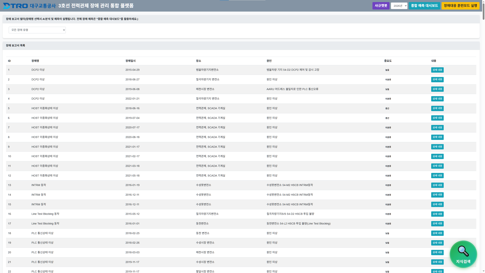

# 🔍 대구교통공사(DTRO) 장애 분석기 (Failure Analyzer)



*▲ 대구교통공사 3호선 전력관제 장애 관리 통합 플랫폼 메인화면*

**독립 실행형 장애 원인 분석 시스템**

이 프로그램은 `incident_reports.db`에 저장된 장애 이력을 통계적으로 분석하고, **Local LLM (Ollama)**을 활용하여 장애의 근본 원인과 조치 방법을 심층 분석하여 리포트를 생성해주는 도구입니다.

### 👤 개발자
- **강동우** (대구교통공사 3호선 경전철관제팀 전력관제)
- *본 프로젝트는 개발자 개인의 연구 결과물입니다.*

## 📜 개발 배경 및 히스토리
- **2025.09:** 통합 플랫폼 구축 당시, 초기 Local LLM의 답변 품질이 낮아 실무 적용에 어려움이 있었습니다.
- **RAG & Fine-tuning 도입:** 이를 해결하기 위해 파인튜닝된 모델과 RAG(검색 증강 생성) 기술을 결합하여 답변의 정교함을 비약적으로 향상시켰습니다.
- **모델 최적화:** 개발 단계에서는 `gemma-3n-E4B` 모델을 사용했으나, 배포 및 시연 환경의 속도 최적화를 위해 현재 버전은 `gemma-3n-E2B` 모델을 기본으로 설정했습니다.

### 💰 개발 성과 (Value)
- **저사양 최적화:** 공기업의 일반 사무용 PC(i3-13100)에서도 Local LLM이 원활히 돌아가도록 최적화했습니다.
- **예산 절감:** 외주 없이 1인 개발로 RAG 기반 분석 시스템을 구축하여 예산을 절감했습니다.

## 🌟 주요 기능
- **통계 분석:** 특정 장애 유형의 발생 빈도, 연간 추이, 주요 원인 및 조치 통계 제공.
- **AI 심층 분석:** LLM을 통해 통계 데이터와 관련 기술 지식(RAG)을 종합하여 상세 분석 보고서 작성.
- **독립 실행:** 다른 모듈 없이 단독으로 실행 가능.

## ⚙️ 설치 및 실행 방법

### 1. 필수 요구 사항
- Python 3.8 이상
- **FastAPI** 프레임워크 (requirements.txt에 포함됨)
- **Ollama** 설치 및 실행 필수

### 2. LLM 모델 준비 (필수)
이 프로그램은 분석을 위해 로컬 LLM(Ollama)을 사용합니다. **반드시 아래 두 모델 중 하나를 다운로드(Pull)해야 합니다.**
(본 시스템은 `E2B` 모델을 기본으로 사용하나, 성능을 위해 `E4B` 모델을 사용할 수도 있습니다.)

**옵션 A (권장 - 고성능):**
```bash
ollama run hf.co/unsloth/gemma-3n-E4B-it-GGUF:Q4_K_M
```

**옵션 B (경량 - 빠른 속도):**
```bash
ollama run hf.co/unsloth/gemma-3n-E2B-it-GGUF:Q4_K_M
```

### 3. 최소 하드웨어 사양 (Minimum Specs)
본 프로그램은 사내의 제한된 하드웨어 환경에 최적화되어 개발되었습니다.
- **CPU:** Intel Core i3-13100 이상
- **RAM:** 16GB 이상
- **GPU:** 불필요 (CPU 연산 최적화)

### 3. 패키지 설치
```bash
pip install -r requirements.txt
```

### 4. 실행
```bash
python main.py
```
실행 후 브라우저에서 `http://localhost:8002` 로 접속하세요.

## 🎨 커스터마이징 가이드
이 프로그램은 누구나 수정해서 사용할 수 있습니다.
- **제목 변경:** `index.html` 파일을 열어 회사명이나 타이틀을 수정하세요.
- **로고 변경:** 폴더 내의 `io.png` 파일을 본인의 로고 파일로 교체(덮어쓰기)하면 됩니다.
- **데이터 교체:**
  - `incident_reports.db`: 본인의 장애 이력 데이터로 교체하면 맞춤형 통계 및 분석이 가능합니다.
  - `dataset_from_data_txt.json`: 자체 매뉴얼이나 기술 문서로 내용을 교체하면, 해당 도메인 지식을 기반으로 AI가 분석 보고서를 작성합니다.

## 📢 통합 플랫폼 안내
본 프로그램은 독립적으로 실행되지만, 추후 공개될 **'장애 관리 통합 플랫폼'**의 일부 모듈입니다. 사용자는 이 모듈들을 결합하여 통합 시스템으로 구축할 수 있으며, 통합된 전체 버전 또한 추후 오픈소스로 공개될 예정입니다.

## 📂 파일 구조
- `main.py`: FastAPI 기반의 메인 서버 코드.
- `incident_reports.db`: 장애 이력 데이터베이스 (샘플: 로봇 장애 데이터).
- `dataset_from_data_txt.json`: RAG 분석을 위한 참조 지식 데이터.

## ⚠️ 참고 사항
- 본 프로그램은 데모를 위해 **가상의 로봇 장애 데이터**를 사용합니다.
- 실제 사용 시 `incident_reports.db`를 본인의 데이터 스키마에 맞게 수정하여 사용하십시오.
